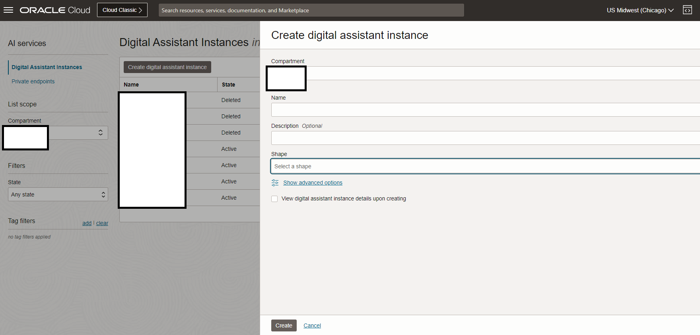

# Provision ODA 

## Introduction

This lab will take you thru the step needed to provision Oracle Digital Assistant & Visual Builder Cloud Service

Estimated Time: 15 minutes

### About Oracle Digital Assistant (Optional)
Oracle Digital Assistant delivers a complete AI platform to create conversational experiences for business applications through text, chat, and voice interfaces

### Objectives

Provisioning of ODA 

In this lab, you will:
* Provision ODA Instance

### Prerequisites 

This lab assumes you have:
* An Oracle Cloud account

*This is the "fold" - below items are collapsed by default*

## Task 1: Provision Oracle Digital Assistant

This task will help you to create Oracle Digital Assistant under your choosen compartment.

1. Step 1 : Locate Digital Assistant under AI Services

	

	> **Note:** You can find Digital Assistant under the AI Services.

2. Step 2 : Provide the information for **Compartment**, **Name** , **Description** (optional) & **Shape**. Click **Create**

    

3. In few minutes the status of recently created Digital Assistant will change from **Provisioning** to **Active**
     

## Acknowledgements
* **Author** - <Nitin Jain, Master Principal Cloud Architect, NACIE>
* **Contributors** -  <Name, Group> -- optional
* **Last Updated By/Date** - <Name, Month Year>
